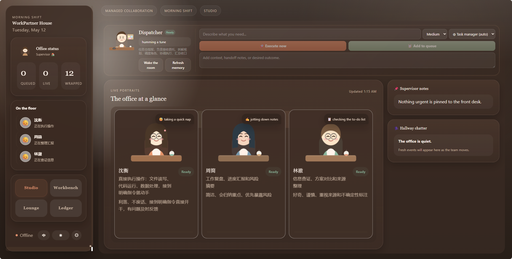

<p align="center">
  
</p>

<h1 align="center">WorkPartner</h1>

<p align="center">
  您的个人 AI 助理团队 —— 运行在本地机器上的"托管办公室"。
</p>

<p align="center">
  <a href="https://www.python.org/downloads/"></a>
  <a href="https://github.com/langchain-ai/langgraph"></a>
  <a href="LICENSE"></a>
  <a href="https://github.com/BaBaLaDy/WorkPartner/stargazers"></a>
</p>

<p align="center">
  <a href="../README.md">English</a>
</p>

---

## 🎯 什么是 WorkPartner？

<p align="center">
  
</p>

WorkPartner **不只是一个聊天机器人** —— 它是一个由"主管"协调的**私有 AI 助理团队**，完全运行在您自己的机器上。您只需说出结果，剩下的 —— 任务分解、调度、执行和最终交付 —— 全部由您的团队自动完成。

基于 [LangGraph](https://github.com/langchain-ai/langgraph) 构建，具备人格化角色、专业团队成员和完整的记忆 + 情感感知系统。

---

## ✨ 亮点

### 👥 人格化团队协作

不再孤军奋战。WorkPartner 为您带来一个完整的"办公室"：

| 角色 | 人设 | 职责 |
|------|------|------|
| **Supervisor（大管家）** | 您的首席助理 | 状态汇报、质量审查、学习、IM 通知 |
| **Task Agent（任务代理）** | 您的私人管家 | 理解意图、分解任务、分派专家 |
| **林澈（Lin Che）** | 研究员 | 信息检索、事实核查、竞品分析 |
| **周简（Zhou Jian）** | 记者 | 整理报告、撰写摘要、风险评估 |
| **沈衡（Shen Heng）** | 执行者 | 文件操作、代码执行、数据处理 |

### 💡 情感与记忆系统

- **情感感知** —— 读取您的疲劳或愉悦状态，并相应调整语气
- **长期记忆** —— 记住您的偏好、项目上下文和习惯
- **"大声思考"** —— 通过 `<thinking>` 协议实时查看 Agent 工作流的每一步
- **自动质量检查** —— 主管审查已完成任务，质量不达标时自动重试

### 🏢 办公室语义层

- **办公室状态 API** —— 实时感知"谁在忙、什么需要关注、办公室氛围"
- **事件叙事** —— 将原始事件转化为自然语言的"走廊消息"
- **协作可见性** —— 任务流、角色交接和过程反馈均可观测

### 🛠️ 30+ 内置工具

桌面控制 · 代码执行 · 网络搜索 · 任务与定时管理 · 子代理分派 · IM 通知 · 以及更多

### 🌐 多种访问渠道

| 渠道 | 说明 |
|------|------|
| **Web UI** | 温暖的"办公室风格"界面，实时团队状态 |
| **CLI** | 终端交互式对话，支持会话管理 |
| **IM 桥接** | 飞书 & Telegram 集成 —— 随时随地指挥团队 |
| **守护进程模式** | 后台任务执行，自动重试与并发控制 |

---

## 🖼️ 界面预览

<p align="center">
  
</p>

<p align="center"><em>"办公室一览" —— 实时监控团队成员状态。</em></p>

---

## 🏗️ 架构

WorkPartner 采用分层架构，确保稳定性和可扩展性：

```
┌──────────────────────────────────────────────────────────┐
│                    入口层                                   │
│   Web UI  │  CLI  │  IM 桥接  │  守护进程                     │
├──────────────────────┬───────────────────────────────────┤
│              WorkPartnerEngine（外观）                       │
│  会话 │ 模型路由 │ 工具注册 │ 记忆管理                        │
│  MCP │ 技能管理 │ 事件总线 │ 主管                             │
├──────────────────────┬───────────────────────────────────┤
│         LangGraph 状态图                                    │
│  pre → chat → tools → END                                │
└──────────────────────┬───────────────────────────────────┘
                       │
         ┌─────────────┴─────────────┐
         │   PromptAssembler          │
         │  interactive / managed /    │
         │  subagent / supervisor      │
         └─────────────────────────────┘
```

### 状态图

```
START → pre → 需要压缩? ──是──→ compress → chat
                    │                               ↑
                    否                              │
                    │                               │
                    ▼                               │
                  chat → 有工具调用 ──tools──→ pre
                            │
                            无工具调用
                            │
                            ▼
                         respond → END
```

---

## 🚀 快速开始

### 前置要求

- Python 3.11+
- Node.js 18+（用于前端开发）
- API Keys（DashScope、Ark 等）

### 安装

```bash
# 1. 克隆仓库
git clone https://github.com/BaBaLaDy/WorkPartner.git
cd WorkPartner

# 2. 创建环境并安装依赖
conda create -n workpartner python=3.11
conda activate workpartner
pip install -r requirements.txt

# 3. 配置环境变量
cp .env.example .env
# 编辑 .env 文件，填入 API Keys
```

### 配置

**步骤 1 —— 在 `.env` 中设置 API Keys：**

```env
# DashScope（Qwen 模型）—— 必需
DASHSCOPE_API_KEY=your_dashscope_key_here

# Ark（字节豆包视觉模型）—— 桌面控制必需
ARK_API_KEY=your_ark_key_here

# 飞书（可选，用于 IM 桥接）
FEISHU_APP_ID=your_app_id
FEISHU_APP_SECRET=your_app_secret
FEISHU_MY_OPEN_ID=your_feishu_open_id

# Telegram（可选，用于 IM 桥接）
TELEGRAM_BOT_TOKEN=your_bot_token
```

**步骤 2 —— 在 `config.yaml` 中配置模型：**

```yaml
providers:
  default: "openai"
  openai:
    api_key: "${DASHSCOPE_API_KEY}"
    model: "qwen3.6-plus"
    base_url: "https://dashscope.aliyuncs.com/compatible-mode/v1"

models:
  chat:
    provider: "openai"
    model: "qwen3.6-plus"
  vision:
    provider: "openai"
    model: "doubao-seed-2-0-lite-260215"
    base_url: "https://ark.cn-beijing.volces.com/api/v3"
    api_key: "${ARK_API_KEY}"
```

> `config.yaml` 支持 `${ENV_VAR}` 语法 —— 值在启动时从 `.env` 解析。

### 运行

分别启动后端和前端（两个终端）：

```bash
# 终端 1 —— 后端（FastAPI，端口 8000）
conda run -n workpartner python -m src.api.dev
```

```bash
# 终端 2 —— 前端（Vite，端口 5173）
cd src/frontend/web && npm run dev
```

然后在浏览器中打开 http://localhost:5173。

---

## 📖 文档

| 章节 | 说明 |
|------|------|
| [功能](#features) | 核心 Agent、30+ 工具、桌面控制、技能系统 |
| [配置](#configuration) | 环境变量、config.yaml 参考 |
| [技能系统](#skill-system) | 通过 SKILL.md 创建和扩展能力 |
| [记忆系统](#memory-system) | 按会话类型分层的记忆注入 |
| [开发](#development) | 运行测试、添加工具/技能、前端开发 |

---

## Features

### 核心 Agent

- **LangGraph 状态图** —— 类型化的状态机，带条件边用于工具路由和上下文压缩
- **流式响应** —— 实时 token 流，通过 `<thinking>` 协议提供推理可见性
- **会话持久化** —— 所有对话通过 `SqliteSaver` 持久化，重启后自动恢复
- **多模型路由** —— 将任务路由到专用模型（chat/utility/vision）以优化成本
- **会话类型** —— `interactive`、`managed`、`subagent`、`supervisor` —— 每种都有定制的系统提示和记忆注入
- **统一提示词装配** —— `PromptAssembler` 模块在所有 4 个会话配置文件中共享单一装配流水线，支持缓存感知排序

### 工具类别

| 类别 | 示例 |
|------|------|
| 文件 | `file_read`、`file_write`、`file_patch` |
| 代码 | `code_run` —— 执行 Python/Shell，带超时 |
| 网络 | `web_search`、`web_extract` |
| 任务 | `todo_add`、`todo_list`、`todo_update`、`todo_delete` |
| 调度 | `cron_add`、`cron_list`、`cron_pause`、`cron_resume` |
| 桌面 | 截图、点击、移动、拖拽、滚动、窗口管理 |
| 子代理 | `subagent_batch` —— 独立上下文的并行分派 |
| IM | `im_notify` —— 发送到飞书/Telegram |

### 桌面控制（Windows）

- 全屏或区域截图，带坐标网格叠加
- 精确鼠标点击、移动、拖拽、滚动
- 键盘输入（ASCII 逐字符，非 ASCII 通过剪贴板粘贴）
- 组合键（如 `ctrl+c`、`win+e`）
- 窗口管理 —— 列出所有窗口，按标题聚焦
- **视觉模型集成** —— 专用视觉模型从截图中读取 UI 元素坐标
- **FAILSAFE** —— 将鼠标移到 (0,0) 角落可中止任何操作

### 多模型路由

| 路由 | 用途 | 默认模型 |
|------|------|---------|
| `chat` | 主对话、复杂推理 | qwen3.6-plus |
| `utility` | 轻量级任务（便宜且快） | qwen3.6-plus |
| `utility_large` | 摘要、记忆提炼 | qwen3.6-plus |
| `vision` | 图像理解（桌面控制） | doubao-seed-2-0-lite |

每条路由可以使用不同的 provider，将轻量级任务路由到更便宜的模型，显著降低成本。

### 技能系统

技能通过简单的 Markdown 文件扩展 Agent 的领域特定能力：

```
skills/
  my-skill/
    SKILL.md          # YAML 前置元数据 + 指令
    scripts/          # 可选：可执行脚本
    references/       # 可选：详细文档
```

- **SKILL.md 标准** —— YAML 前置元数据，包含名称、描述、允许的工具
- **两级注入** —— L1 元数据始终在系统提示中，L2 完整指令在显式触发时加载
- **双语匹配** —— 支持中英文技能名称识别

### 记忆系统

**原则："不执行，不记忆"** —— 只有通过工具执行验证的信息才会持久化。

| 文件 | 用途 | 更新触发 |
|------|------|---------|
| `execution_log.jsonl` | 追加式任务完成/失败日志 | 自动（无需 LLM） |
| `patterns.md` | 跨天提炼的 SOP | LLM（utility_large） |
| `user_prefs.md` | 用户偏好 | 手动编辑 |
| `today.md` | 交互式会话摘要 | 会话关闭时 |

**按会话类型分层注入：**

| 层 | Interactive | Managed |
|----|:-----------:|:-------:|
| `user_prefs.md` | ✅ | ❌ |
| `today.md` | ✅ | ❌ |
| `patterns.md` | ❌ | ✅ |
| `execution_log` | ❌ | ✅ |

### 后台执行（守护进程）

- `--daemon` 标志启动后台任务轮询，无需 UI
- 每 30 分钟轮询待执行任务（可配置）
- **并发控制** —— 最多 N 个并行任务
- **自动重试** —— 失败任务最多重试 3 次，指数退避
- **事件总线** —— 任务生命周期事件，用于跨组件通信

### IM 桥接

| 平台 | 功能 |
|------|------|
| **飞书/Lark** | WebSocket 或 HTTP Webhook，富文本/图片/文件/语音，群 @提及 |
| **Telegram** | 长轮询或 Webhook，MarkdownV2，媒体下载，机器人命令 |

- **每会话线程路由** —— 每个 IM 聊天映射到独立的 LangGraph 线程
- **消息去重** —— 基于 TTL 的去重，防止双重处理
- **策略控制** —— DM/群组访问策略（开放 / 白名单 / 禁用）

### 主管代理（Supervisor）

- **每日报告** —— 定时每日总结已完成和待处理工作
- **质量检查** —— 基于启发式规则审查已完成任务输出
- **自动重试** —— 质量审查失败时自动重试最多 2 次
- **经验学习** —— 从成功会话中提炼调度模式
- **行动项跟踪** —— 提取并展示后续行动
- **聊天功能** —— 直接与主管对话，询问"今天做了什么"或"团队怎么样"

### MCP 集成

- **动态工具注入** —— 运行时连接 MCP 服务器获取额外能力
- **自动连接** —— 可配置的 MCP 服务器在启动时自动连接
- **工具前缀** —— MCP 工具以 `mcp_` 前缀命名空间，避免冲突

---

## 项目结构

```
├── src/
│   ├── main.py                    # CLI 入口
│   ├── agent/                     # LangGraph 会话、图、节点、边
│   │   ├── prompt/                # PromptAssembler —— 统一提示词装配
│   │   ├── nodes/                 # 图节点（chat、tools、compress）
│   │   └── edges/                 # 条件边逻辑
│   ├── core/                      # 引擎、后台执行器、主管
│   ├── hub/                       # 事件总线（发布/订阅）
│   ├── memory/                    # 记忆管理器 —— 分层注入
│   ├── narrative/                 # 事件叙事 —— 原始事件 → 走廊消息
│   ├── providers/                 # LLM 提供商工厂和路由
│   ├── roles/                     # 角色定义
│   ├── services/                  # 线程安全的服务包装器
│   ├── skills/                    # 技能加载和注入
│   ├── tasks/                     # 任务和调度器管理
│   ├── tools/                     # 工具注册和实现
│   ├── mcp/                       # MCP 客户端 —— 动态工具注入
│   ├── api/                       # FastAPI REST + WebSocket API
│   │   └── routes/                # 路由（chat、office_state、roles...）
│   ├── im_bridge/                 # 飞书 & Telegram 适配器
│   └── frontend/web/              # React + TypeScript Web UI
├── skills/                        # 已安装的技能目录
├── memory/                        # 持久化记忆文件
├── history/                       # 会话检查点（SqliteSaver）
├── roles/                         # 角色定义（YAML 前置 + Markdown）
├── config.yaml                    # Agent 配置
├── .env.example                   # 环境变量模板
└── requirements.txt               # Python 依赖
```

---

## Configuration

### 环境变量

| 变量 | 说明 |
|------|------|
| `DASHSCOPE_API_KEY` | DashScope（通义千问）API Key |
| `ARK_API_KEY` | Ark（字节豆包）视觉模型 API Key |
| `TELEGRAM_BOT_TOKEN` | Telegram Bot Token |
| `FEISHU_APP_ID` | 飞书 App ID |
| `FEISHU_APP_SECRET` | 飞书 App Secret |

### config.yaml 章节

| 章节 | 说明 |
|------|------|
| `agent` | 名称、最大轮次、压缩阈值 |
| `providers` | LLM 提供商配置（API Key、base_url、模型、max_tokens、temperature） |
| `models` | 按用途路由的模型（chat / utility / utility_large / vision） |
| `desktop` | 网格间距、FAILSAFE、DPI 感知、视觉模型 |
| `skills` | 技能目录、自动加载开关 |
| `tools` | 启用的工具列表 |
| `executor` | 轮询间隔、最大并发任务、最大重试次数 |
| `supervisor` | 每日报告时间、质量检查模式 |
| `im_bridge` | IM 适配器配置（飞书、Telegram） |
| `mcp` | MCP 客户端设置（自动连接、工具前缀） |

完整参考见 `config.yaml`。

---

## Usage

### Web 界面

| 标签页 | 功能 |
|--------|------|
| **Chat** | 交互式对话 —— 流式响应、工具调用可视化 |
| **Tasks** | 创建/更新/删除任务，跟踪执行状态 |
| **Schedule** | 创建/暂停/恢复/删除定时任务 |
| **Timeline** | 定时任务执行的时间线可视化 |
| **Sessions** | 浏览历史对话 |
| **Settings** | 模型选择、工具开关、IM 渠道 |
| **Team** | 管理代理角色和权限 |

### CLI 命令

| 命令 | 说明 |
|------|------|
| `/sessions` | 列出所有会话 |
| `/switch <name>` | 切换到指定会话 |
| `/new <name>` | 创建新会话 |
| `/delete <name>` | 删除会话 |
| `/clear-reset` | 重置 Agent 图（历史保留） |
| `/exit` | 退出 |

---

## Development

### 运行测试

```bash
pip install -r requirements-dev.txt
conda run -n workpartner pytest tests/
conda run -n workpartner pytest tests/ --cov=src --cov-report=term-missing
```

### 添加工具

```python
from src.tools.registry import ToolRegistry

registry = ToolRegistry()

@registry.register(
    name="my_tool",
    description="Description of what this tool does.",
)
def my_tool(param: str) -> str:
    """Tool implementation."""
    return f"Result: {param}"
```

然后在 `config.yaml` 的 `tools.enabled` 中添加 `my_tool`。

### 前端开发

```bash
cd src/frontend/web
npm run dev     # Vite 开发服务器，热重载
npm run build   # 构建生产静态文件
npm run lint    # 运行 ESLint
```

---

## Roadmap

| 阶段 | 状态 | 说明 |
|------|------|------|
| 1-4 | ✅ | 核心状态、会话类型、后台执行内核 |
| 5 | ✅ | 多模型路由、pytest、工具 Schema |
| 6 | ✅ | React Web 前端（Chat / Tasks / Schedule / Timeline） |
| 7 | ✅ | SubAgent 并行执行 |
| 8 | ✅ | 记忆系统（execution_log + patterns + user_prefs） |
| 9 | ✅ | 桌面控制 + MCP 集成 |
| 10 | ✅ | IM 桥接（飞书 / Telegram） |
| 11 | ✅ | 主管代理 + 每日报告 + 质量检查 |
| 12 | ✅ | 统一提示词装配（PromptAssembler）+ 缓存优化 |
| 13 | ✅ | 办公室语义层（状态 API + 事件叙事） |
| 14+ | 📋 | 角色人设契约、情感记忆、插件系统 |

---

## ⚠️ 安全须知 — 部署前请阅读

WorkPartner 是一个**以你自己的权限行动的个人助手**。按设计它可以：

- **在你的机器上执行任意代码**（`code_run` 工具）
- **控制你的桌面** —— 鼠标、键盘、截图（`desktop_*` 工具）
- **读写你账户可访问的任何文件**（`file_*` 工具）

这正是本项目的意义所在，但也意味着你应当：

1. **只在你信任的机器上运行它**，在让 IM 渠道无人值守地触发任务前三思。
2. **保持 API 服务仅本机可访问。** 它没有鉴权，默认绑定 `127.0.0.1`——不要把 8000 端口暴露到网络。
3. **永远不要提交你的 `.env`。** 复制 `.env.example` 并将真实密钥保存在本地。
4. **配置 IM 访问策略。** 如果启用飞书/Telegram 桥接，私聊默认为 `allowlist` 模式——请先在 `config.yaml` 的 `allow_from` 中加入你自己的用户 ID。"open" 群策略会让任何 @机器人的人都能向它下达指令。
5. **飞书 Webhook 模式：** 如果 webhook 端点必须公网可达，请置于带 HTTPS 的反向代理之后，并设置 `FEISHU_VERIFY_TOKEN` 以拒绝伪造事件。

---

## License

[MIT](../LICENSE)
